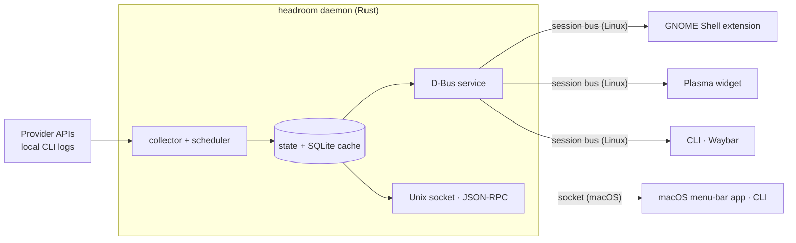

<div align="center">


# Headroom

**How much of your AI coding limits is left, right in your Linux top panel and macOS menu bar.**

Codex, Claude, Copilot, Cursor and 10 more. Session and weekly limits, reset times, a pace forecast
and exact token counts, in a native GNOME Shell extension, a KDE Plasma widget and a macOS menu-bar
app.

[](LICENSE)
[](rust-toolchain.toml)
[](shell/gnome)
[](shell/plasma)
[](docs/macos.md)
[](#requirements)
[](https://github.com/daniarjabagin/headroom/actions/workflows/ci.yml)

[Install](#-install) · [Quick start](#-quick-start) · [Providers](#-supported-providers) ·
[How it works](#-how-it-works) · [macOS](#macos) · [Changelog](CHANGELOG.md)

</div>

<br>

<p align="center">
  <picture>
    <source media="(prefers-color-scheme: dark)" srcset="docs/screenshots/popup-dark.png">
    <source media="(prefers-color-scheme: light)" srcset="docs/screenshots/popup-light.png">
    
  </picture>
</p>

You are halfway through a refactor and the agent stops: *limit reached, resets in 3 hours.* Headroom
exists so that never comes as a surprise. It sits in your panel or menu bar as a small ring, tells
you how much is left at a glance, and warns you while there is still time to slow down or switch
accounts.

<table>
  <tr>
    <td align="center" width="33%">
      
      <br><sub><b>GNOME</b> · extension preferences</sub>
    </td>
    <td align="center" width="33%">
      
      <br><sub><b>KDE Plasma</b> · panel widget</sub>
    </td>
    <td align="center" width="33%">
      <picture>
        <source media="(prefers-color-scheme: dark)" srcset="docs/screenshots/macos-dark.png">
        <source media="(prefers-color-scheme: light)" srcset="docs/screenshots/macos-light.png">
        
      </picture>
      <br><sub><b>macOS</b> · menu-bar app</sub>
    </td>
  </tr>
</table>

<sub>Screenshots use sample data.</sub>

## ✨ Highlights

- **Every limit, one glance.** Session, weekly, per-model and monthly windows, credit balances and
  reset countdowns for 14 providers, several accounts each.
- **Pace forecast.** Every meter carries an even-pace tick. Headroom projects your burn rate and tells
  you *"At this pace: runs out in 2d 1h"* long before the wall. Color follows pace, not just level.
- **Exact token counts.** Local logs of Codex, Claude Code and Grok are read incrementally and
  deduplicated by stable response ids, never by summing streaming chunks. Cache reads, 5-minute and
  1-hour cache writes and reasoning tokens are kept apart as raw integers.
- **Honest spend.** Cost is computed in integer micro-dollars from bundled LiteLLM and models.dev price
  snapshots that refresh in the background, re-costing history when prices change. Models without a
  price are flagged as *partial*, never guessed. Where a tool logs its own cost (Grok), that exact
  figure is used.
- **Notifications that matter.** *Under 10 % left*, *projected to run out in …*, *limit reset*. Sent
  once per window, remembered across restarts, through your desktop's notifications or macOS
  Notification Center.
- **Native everywhere.** A GNOME Shell extension, a Plasma 6 widget and a SwiftUI menu-bar app with
  the same popup: spend donut, limits with pace, 30-day trend and model breakdown. Plus a CLI and a
  Waybar module for everything else.
- **Light and dark, English and Russian.** Both themes are first-class and follow the system; motion
  respects reduced-motion settings.
- **Tiny footprint.** One ≈11 MB binary. On Linux the daemon idles at ≈19 MB RSS on two worker
  threads and watches logs with inotify instead of polling in a loop.
- **Private by design.** No telemetry, no accounts, no cloud of its own. See
  [Privacy & security](#-privacy--security).

## 🧩 Supported providers

| Provider | What you see | How an account is added |
| --- | --- | --- |
| **Codex** | Session and weekly limits, extra per-model limits, credits, tokens and spend from local logs | Found from the `codex` CLI; more accounts with `headroom accounts add codex` |
| **Claude** | Session, weekly and per-model limits, tokens and spend from local logs | Found from Claude Code config dirs; more with `headroom accounts add claude` |
| **OpenCode** | OpenCode Go session, weekly and monthly limits | Paste an API key, or detected from `opencode auth login` |
| **OpenRouter** | Credit balance, key limit, spend today / this week / this month | Paste an API key |
| **Z.ai** | Session, weekly and monthly limits, web searches | Paste an API key |
| **Kimi Code** | Session, weekly and per-model limits | Paste a Kimi Code API key, or sign in with `kimi` |
| **MiniMax** | Session and weekly Token Plan limits | Paste a Token Plan key |
| **Grok** | Weekly credit usage, extra-usage cap, tokens and exact logged cost | Sign in with `grok`, or detected from `~/.grok` |
| **Cline** | Personal and organization credits | Sign in with `cline`, or detected from `~/.cline` |
| **Devin** | Daily and weekly limits, extra-usage balance | Sign in with `devin`, or detected from the Devin CLI or app |
| **Copilot** | Chat, completions and credit quotas, extra usage | Every account signed in to `gh` is found; more with `headroom accounts add copilot` |
| **Cursor** | Total, Auto, API and request usage, on-demand spend | Detected from the Cursor app or `agent login` (one account) |
| **Antigravity** | Session and weekly limits, Claude model limits | Detected from the running app or `agy` (one account). Linux only for now |
| **Ollama Cloud** | Session, weekly and monthly limits, extra usage | Detected from `~/.ollama/id_ed25519` when linked to ollama.com (one account) |

On macOS, Claude Code and Codex sign-ins are read from the Keychain (read-only, with a one-time
"Always Allow" prompt), Copilot asks `gh`, which keeps its tokens there too, and API keys you add go
into the Keychain. `headroom providers` prints the same list for your build. Missing a provider? The
[provider guide](docs/architecture.md#adding-a-provider) shows how one is added.

## 📦 Install

### Linux: one-line installer

```sh
curl -fsSL https://github.com/daniarjabagin/headroom/releases/latest/download/get-headroom.sh | sh
```

Downloads the static binary for x86_64 or aarch64, verifies it against `SHA256SUMS` and installs into
`~/.local`: the binary, the systemd user service, D-Bus activation, the GNOME Shell extension and the
Plasma widget. Options go after `sh -s --`: `--no-gnome`, `--no-plasma`, `--no-service`. Pin a
release with `HEADROOM_VERSION=v0.4.0`.

### Linux: packages

Every release ships `.deb`, `.rpm` and Arch Linux `.pkg.tar.zst` packages for x86_64 and aarch64.
They install `/usr/bin/headroom`, the user service, D-Bus activation, the GNOME extension and the
Plasma widget system-wide.

```sh
sudo apt install ./headroom_*_amd64.deb          # Debian, Ubuntu
sudo dnf install ./headroom-*.x86_64.rpm         # Fedora (zypper install on openSUSE)
sudo pacman -U ./headroom-*-x86_64.pkg.tar.zst   # Arch Linux
```

Then, as your user:

```sh
systemctl --user enable --now headroom.service
gnome-extensions enable headroom@daniarjabagin.github.io   # GNOME; on Plasma, add the Headroom widget
```

Verify downloads with `sha256sum -c SHA256SUMS --ignore-missing` or
`gh attestation verify <file> --repo daniarjabagin/headroom`.

### Linux: from source

```sh
packaging/install.sh                # binary, user service, D-Bus activation, GNOME extension
packaging/install.sh --no-gnome     # skip the GNOME Shell extension
packaging/install.sh --no-service   # install ~/.local/bin/headroom only
make -C shell/plasma install        # Plasma widget
```

The script is idempotent, so run it again to upgrade. `packaging/uninstall.sh` removes everything and
keeps your data. On Wayland, log out and back in before enabling a freshly installed GNOME extension.

### Requirements

- Linux on x86_64 or aarch64 with a systemd user session and a D-Bus session bus, Wayland or X11
- A panel: GNOME Shell 46–50, KDE Plasma 6.2+ (live updates on 6.4+, polling before), or Waybar
- Optional: a Secret Service keyring (GNOME Keyring, KWallet) for API keys
- Building from source: Rust 1.98; the GNOME extension also needs `gnome-extensions`,
  `glib-compile-schemas` and `python3`

### macOS

The menu-bar app lives in [`shell/macos`](shell/macos): SwiftUI and AppKit around the same Rust
daemon, which the app bundles and starts by itself. It needs **macOS 14 Sonoma or newer** and runs
natively on Apple silicon; `bundle.sh --universal` adds an x86_64 slice for Intel Macs.

There is no packaged download yet. A signed and notarized DMG and a Homebrew cask are next on the
[roadmap](#-roadmap); until then, build it from source. You need full **Xcode** (Swift 6, from the
App Store) and **Rust** through [rustup](https://rustup.rs), which picks up the pinned toolchain by
itself.

```sh
shell/macos/script/bundle.sh --install --open
```

This builds the daemon and the app, assembles and signs `Headroom.app`, copies it to
`/Applications` and launches it. Headroom has no Dock icon: click its item in the menu bar for the
popup, right-click for Refresh, Settings and Quit.

By default the app is signed ad-hoc, so macOS asks again for Keychain access after every rebuild.
Sign with a free Apple Development certificate to keep the "Always Allow" grants:

```sh
CODESIGN_IDENTITY="Apple Development: you@example.com (TEAMID1234)" \
    shell/macos/script/bundle.sh --install --open
```

Settings → Service turns on launch at login. The [macOS guide](docs/macos.md) covers first-run
prompts, files and logs, development and troubleshooting.

## 🚀 Quick start

Signed in to `codex` or `claude` already? Headroom finds those accounts by itself. For everything else,
open **Settings → Accounts → Add account…** in the popup, pick a provider and sign in or paste a key.
The same works from a terminal (on macOS the CLI is
`/Applications/Headroom.app/Contents/Helpers/headroom`):

```sh
headroom providers                          # what this build supports and how to add each one
headroom accounts add codex --label work    # runs `codex login` in a separate Headroom-owned home
headroom accounts add openrouter            # asks for the API key without echoing it
headroom accounts add zai --api-key-stdin < key.txt
```

Look at your limits:

```text
$ headroom status
Claude · work@example.com  Max 5x
  Session  ━━━━━━━━━━━━━━━━━━━─   95% left  resets in 4h 35m
  Weekly   ━━━━━━━━━━━━━──┃────   66% left  resets in 5d 7h    limit in 3d 6h

Codex · work@example.com  Pro
  Weekly   ━━━━━━━━━━━━━━━━━━━━   99% left  resets in 5d 22h

Spend  estimated from local logs
  Today          $9.69  9.8M tokens
  Yesterday     $30.46  87M tokens
  30 days      $285.74  290M tokens
```

More commands:

```sh
headroom status --json               # the full state payload, see docs/dbus-api.md
headroom refresh --now               # refresh every account right away
headroom accounts                    # list accounts with their ids
headroom accounts label ID "Work"    # rename; also: hide, show, order ID1 ID2 …
headroom accounts remove ID          # delete an account Headroom added (never ~/.codex or ~/.claude)
```

Without a running daemon, `status` shows the last cached data.

### Waybar

`headroom waybar` streams one JSON line per change: the headline percentage, a tooltip with every
account and your spend, and a `good`, `warning`, `critical` or `neutral` class.

```jsonc
"custom/headroom": {
    "exec": "headroom waybar",
    "return-type": "json",
    "format": "{text}",
    "tooltip": true
}
```

```css
#custom-headroom.warning  { color: #ffd60a; }
#custom-headroom.critical { color: #ff453a; }
#custom-headroom.neutral  { opacity: 0.6; }
```

### Custom CLI homes

The daemon finds Codex in `$CODEX_HOME` (default `~/.codex`) and Claude Code in `$CLAUDE_CONFIG_DIR`
(default `~/.claude`, plus other Claude config dirs it discovers). If you set these in your shell, set
them for the user service too, in `~/.config/environment.d/headroom.conf`, then log in again. Logs:
`journalctl --user -u headroom -f`.

## 🛠 How it works



One core, thin shells. On Linux the daemon runs as a systemd user service and speaks D-Bus; on macOS
the menu-bar app starts it as a bundled helper and talks to it over a Unix socket with the same
JSON. The Rust daemon owns all network access, credentials and files. It refreshes
each account every 5 minutes with jitter, backs off exponentially on errors and honours `Retry-After`
on 429s. Pace, tone and totals are computed once, in the daemon; the panels only render them, so every
surface shows the same number, on every platform.

- [Architecture](docs/architecture.md): domain model, pacing formula, providers, daemon
- [D-Bus API](docs/dbus-api.md): methods, signals and the JSON state payload
- [Socket API](docs/ipc.md): the same commands and events as line-delimited JSON-RPC
- [macOS app](docs/macos.md): how the app, the helper and the Keychain fit together
- [Design system](docs/design/design-system.md): tokens and components shared by every shell

## ⚖️ How it compares

Headroom stands on the shoulders of two excellent MIT-licensed projects. They are good choices too;
this is what differs.

| | Headroom | [OpenUsage](https://github.com/robinebers/openusage) | [OpenQuota](https://github.com/deviffyy/OpenQuota) |
| --- | --- | --- | --- |
| Platforms | Linux + macOS 14+ | macOS 15+ | Windows, macOS, Linux |
| Built with | Rust daemon + native shells (GJS, QML, SwiftUI) | Swift, SwiftUI | Tauri 2, Rust, Svelte |
| Lives in | GNOME top panel, Plasma panel, Waybar, macOS menu bar | macOS menu bar | System tray, app window |
| Providers | 14 | 11 | 12 |
| License | MIT | MIT | MIT |

## 🗺 Roadmap

- [x] GNOME Shell extension and KDE Plasma widget
- [x] 14 providers, several accounts each
- [x] **macOS menu-bar app** on the same Rust core
- [ ] Signed, notarized macOS DMG and a Homebrew cask
- [ ] Tray icon with a GTK4 popover for desktops without GNOME or Plasma
- [ ] Antigravity on macOS
- [ ] Terminal UI
- [ ] More providers

## 🔒 Privacy & security

- **Local only.** Headroom talks to the providers you use and fetches public price lists (LiteLLM,
  models.dev). Nothing else. No telemetry, no analytics, no Headroom server.
- **CLI credentials are read-only.** `~/.codex/auth.json`, `~/.claude/.credentials.json`, the Claude
  Code and Codex Keychain items on macOS and friends are never written or refreshed. Headroom
  refreshes only the sign-ins it created itself, in its own data directory
  (`~/.local/share/headroom/accounts/` on Linux, `~/Library/Application Support/Headroom/` on macOS,
  mode `0700`).
- **API keys** live in the Secret Service keyring on Linux and in the Keychain on macOS, with a
  `0600` file as fallback when no keyring is available. They never appear in logs, errors, process
  arguments or D-Bus and socket payloads.
- **Shells never see secrets.** Panels and the menu-bar app talk only to the daemon, over the session
  bus or a socket that only your user can open.

## 🤝 Contributing

Issues and pull requests are welcome. Read [CLAUDE.md](CLAUDE.md) for the engineering rules (no
floats for money or tokens, typed errors, small functions, fixture-based tests), then:

```sh
cargo fmt --all
cargo clippy --workspace --all-targets -- -D warnings
cargo test --workspace
make -C shell/gnome lint test     # GNOME extension: eslint, prettier, gjs unit tests
make -C shell/plasma lint test    # Plasma widget: qmllint, qmlformat, qmltestrunner
(cd shell/macos && swift test)    # macOS app: HeadroomKit unit tests
```

Commits follow [Conventional Commits](https://www.conventionalcommits.org). Run the daemon from a
checkout with `cargo run -p headroom -- daemon`.

## 🙏 Acknowledgements

- [OpenUsage](https://github.com/robinebers/openusage) by Robin Ebers, the look Headroom's popup is
  modelled on.
- [OpenQuota](https://github.com/deviffyy/OpenQuota), whose provider research informed Headroom's data
  collection and pacing.
- [Simple Icons](https://simpleicons.org) (CC0-1.0) for the provider logos. Logos are trademarks of
  their owners; Headroom is not affiliated with or endorsed by any provider.
- Price data from [LiteLLM](https://github.com/BerriAI/litellm) and [models.dev](https://models.dev).

## 📄 License

[MIT](LICENSE) © 2026 Daniar Jabagin
