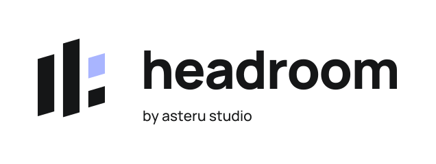
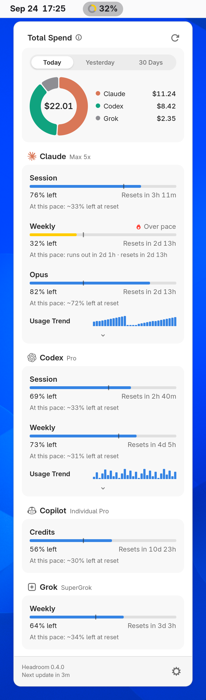
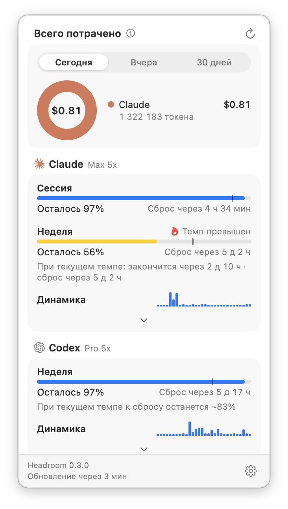
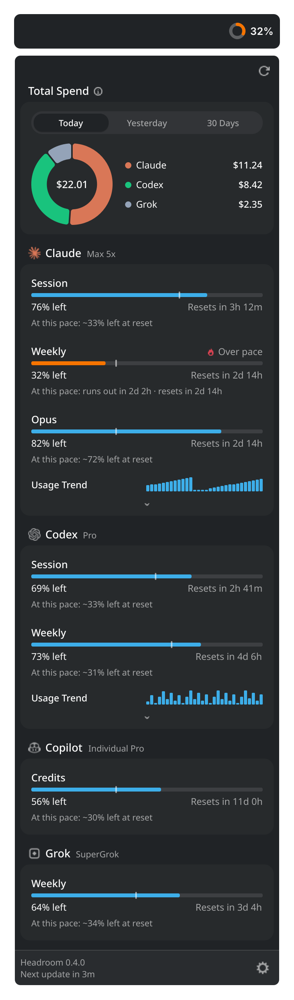
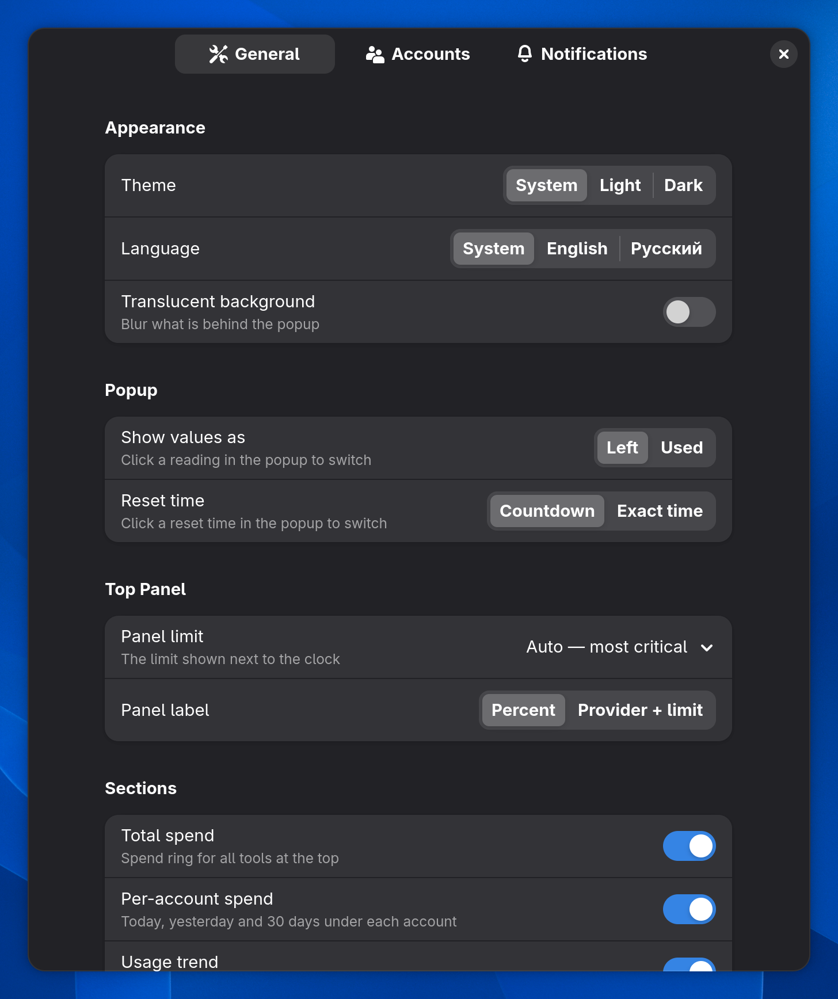
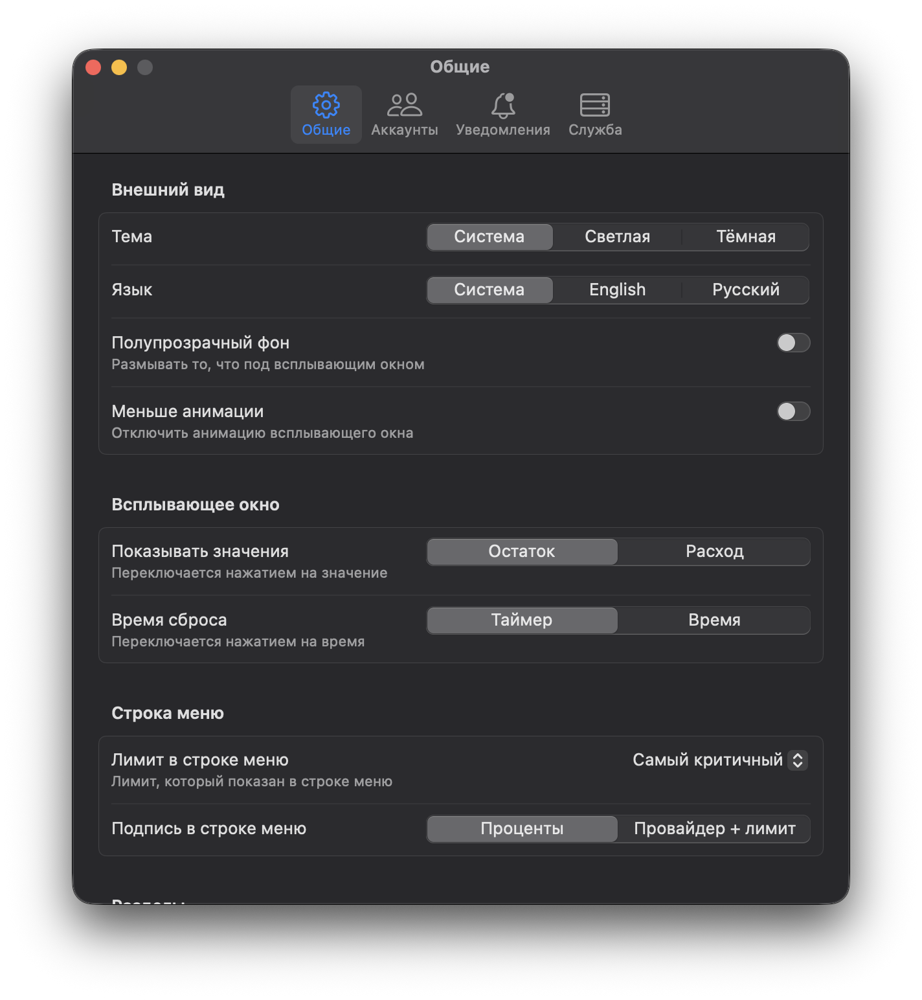
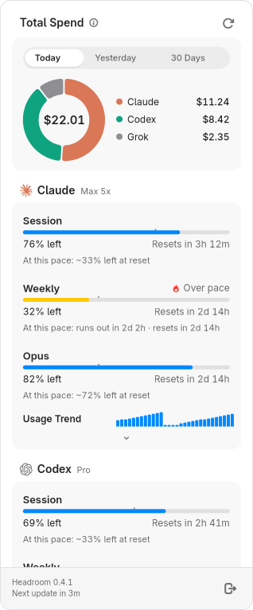
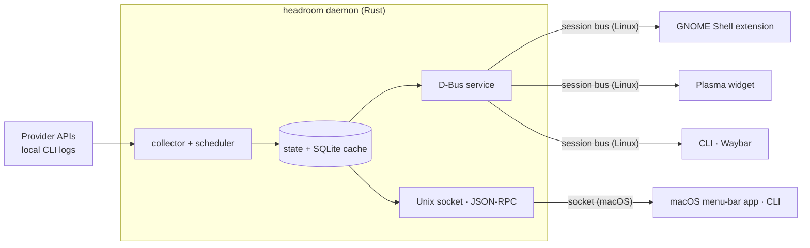

<div align="center">

<picture>
  <source media="(prefers-color-scheme: dark)" srcset="assets/brand/headroom-logo-on-dark.svg">
  
</picture>

### Know what's left.

How much of your AI coding limits is left, in your Linux top panel and macOS menu bar.

[](https://github.com/daniarjabagin/headroom/releases/latest)
[](https://github.com/daniarjabagin/headroom/actions/workflows/ci.yml)
[](LICENSE)
[](#requirements)
[](#requirements)
[](#macos)

[Install](#install) · [Updates](#updates) · [Quick start](#quick-start) · [Providers](#providers) ·
[Settings](#settings) · [Privacy](#privacy) · [How it works](#how-it-works) · [Changelog](CHANGELOG.md)

</div>

<br>

<p align="center">
  <picture>
    <source media="(prefers-color-scheme: dark)" srcset="docs/screenshots/popup-dark.png">
    
  </picture>
</p>

You are halfway through a refactor and the agent stops: *limit reached, resets in 3 hours.*
Headroom exists so that never comes as a surprise. It sits in your panel or menu bar as a small
ring, tells you at a glance how much is left, and warns you while there is still time to slow down
or switch accounts.

<table>
  <tr>
    <td align="center" valign="top" width="25%">
      <picture>
        <source media="(prefers-color-scheme: dark)" srcset="docs/screenshots/mac-popup-dark.png">
        
      </picture>
      <br><sub><b>macOS</b> · menu-bar app</sub>
    </td>
    <td align="center" valign="top" width="25%">
      
      <br><sub><b>KDE Plasma</b> · panel widget</sub>
    </td>
    <td align="center" valign="top" width="25%">
      
      <br><sub><b>GNOME</b> · preferences</sub>
    </td>
    <td align="center" valign="top" width="25%">
      
      <br><sub><b>macOS</b> · settings</sub>
    </td>
  </tr>
</table>

<sub>Linux screenshots use sample data. The macOS shots show the Russian interface; English is the
default.</sub>

## Highlights

- **Every limit, one glance.** Session, weekly, per-model and monthly windows, credit balances and
  reset countdowns for 19 providers, with several accounts each. Turn on **combined accounts** to
  see one card per provider with a segmented bar: *145% left of 200%*.
- **Pace forecast.** Every meter carries an even-pace tick. Headroom projects your burn rate and
  tells you *"At this pace: runs out in 2d 1h"* long before you hit the wall. Color follows pace,
  not just level.
- **Exact token counts.** Local logs of Codex, Claude Code and Grok are read incrementally and
  deduplicated by stable response ids, never by summing streaming chunks. Cache reads, 5-minute and
  1-hour cache writes and reasoning tokens are kept apart as raw integers.
- **Honest spend.** Cost is computed in integer micro-dollars from bundled LiteLLM and models.dev
  price lists that refresh in the background and re-cost history when prices change. Models without
  a price are flagged as *partial*, never guessed. Where a tool logs its own cost (Grok), that exact
  figure is used. Pay-as-you-go balances keep their own currency (¥, €, $), never converted.
- **Spend by model and by project.** Today, yesterday, 7 or 30 days, in dollars, tokens or cost per
  million tokens, broken down by model or by the project directory you worked in.
- **Your panel, your way.** One limit, up to three side by side, or just the Headroom mark tinted
  by the worst tone; as a ring, a mini bar with the pace tick or plain text. In GNOME, drag it
  anywhere on the top bar. A global shortcut opens the popup, and numbers hide while you share your
  screen.
- **Notifications that matter.** *Under 10 % left* (or your own threshold per provider), *projected
  to run out in …*, *limit reset*. Sent once per window, remembered across restarts, held during
  quiet hours and delivered as one summary afterwards.
- **Retry that fixes things.** Sign in again through the CLI and the card comes back by itself;
  Headroom's own sign-ins refresh their tokens; the error card offers exactly what helps: retry,
  sign in again or the CLI's login command.
- **Native everywhere.** A GNOME Shell extension, a KDE Plasma 6 widget, a GTK 4 tray app for every
  other Linux desktop and a SwiftUI menu-bar app with the same popup: spend donut, limits with pace,
  30-day trend and model breakdown. Plus a CLI, a Waybar module and `headroom guard` for scripts.
- **Stays current.** Linux installs tell you when a new release is out and update in one click;
  the macOS app updates itself with Sparkle.
- **Light and dark, English and Russian.** Both themes are first-class and follow the system;
  motion respects reduced-motion settings.
- **Tiny footprint.** One static ≈12 MB binary (5.9 MB as a package). On Linux the daemon idles at
  ≈15 MB RSS on two worker threads (short peaks around 35 MB while it re-reads logs or price lists)
  and watches logs with inotify instead of polling. The optional tray is a 4.6 MB GTK app; the
  macOS DMG is 15.3 MB.
- **Private by design.** No telemetry, no accounts, no server of its own. See [Privacy](#privacy).

## Providers

| Provider | What you see | How an account is added |
| --- | --- | --- |
| **Codex** | Session and weekly limits, extra per-model limits, credits, tokens and spend from local logs | Found from the `codex` CLI; more accounts with `headroom accounts add codex` |
| **Claude** | Session, weekly and per-model limits, tokens and spend from local logs | Found from Claude Code config dirs; more with `headroom accounts add claude` |
| **OpenCode** | OpenCode Go session, weekly and monthly limits | Paste an API key, or detected from `opencode auth login` |
| **OpenRouter** | Credit balance, key limit, spend today, this week and this month | Paste an API key |
| **Z.ai** | Session, weekly and monthly limits, web searches | Paste an API key |
| **Kimi Code** | Session, weekly and per-model limits | Paste a Kimi Code API key, or sign in with `kimi` |
| **MiniMax** | Session and weekly Token Plan limits | Paste a Token Plan key |
| **Grok** | Weekly credit usage, extra-usage cap, tokens and exact logged cost | Sign in with `grok`, or detected from `~/.grok` |
| **Cline** | Personal and organization credits | Sign in with `cline`, or detected from `~/.cline` |
| **Devin** | Daily and weekly limits, extra-usage balance | Sign in with `devin`, or detected from the Devin CLI or app |
| **Copilot** | Chat, completions and credit quotas, extra usage | Every account signed in to `gh` is found; more with `headroom accounts add copilot` |
| **Cursor** | Total, Auto, API and request usage, on-demand spend | Detected from the Cursor app or `agent login` (one account) |
| **Antigravity** | Session and weekly limits, Claude model limits | Detected from the running app or `agy` (one account). **Linux only** for now |
| **Ollama Cloud** | Session, weekly and monthly limits, extra usage | Detected from `~/.ollama/id_ed25519` when linked to ollama.com (one account) |
| **Kilo Code** | Credit balance in USD (personal or organization), used-up warning | Sign in with `kilo`, paste a Kilo API key, or detected from `kilo auth login` |
| **Warp** | Monthly credits and reset time, bonus credits | Paste a Warp API key (`wk-…`) |
| **Poe** | Point balance | Paste a Poe API key |
| **DeepSeek** | API balance in each currency the account holds (¥ or $) | Paste an API key |
| **Moonshot API** | Kimi Open Platform balance, vouchers and cash, in $ (platform.kimi.ai) or ¥ (mainland) | Paste an API key |

On macOS, Claude Code and Codex sign-ins are read from the Keychain (read-only, after an "Always
Allow" prompt), Copilot asks `gh`, which keeps its tokens there too, and API keys you add go into
the Keychain. `headroom providers` prints the same list for your build. Missing a provider? The
[provider guide](docs/architecture.md#adding-a-provider) shows how one is added.

## Privacy

- **Local only.** Headroom talks to the providers you use and fetches public price lists (LiteLLM,
  models.dev). It has no telemetry, no analytics and no server of its own.
- **One update check a day.** The Linux daemon asks GitHub's release API
  (`api.github.com/repos/daniarjabagin/headroom/releases/latest`) once a day whether a newer
  Headroom exists, plus once when you press **Check now** (at most once a minute); the macOS app
  reads the release feed (`appcast.xml`) from GitHub once a day. Nothing is sent besides the request
  itself: no identifiers, accounts, usage or settings. Turn it off in the settings (Check for updates
  on Linux, Settings → Service → App updates on macOS).
- **Status pages only when you ask.** Provider status pages are off by default. Turned on, the
  daemon reads the public status page of each provider you have an account with, every 5 minutes:
  one `GET` of `/api/v2/summary.json` on status.claude.com, githubstatus.com (Copilot),
  status.cursor.com, devinstatus.com, status.moonshot.cn (Kimi Code and Moonshot API), status.minimax.io,
  status.kilo.ai and status.warp.dev, one `GET` of `/api/v2/components.json` on status.poe.com, and
  two on status.openai.com for Codex (`/api/v2/components.json` and `/api/v1/summary`). The requests
  carry only the usual `User-Agent` and `Accept` headers and the page's last `ETag`. Other providers
  have no status page Headroom reads.
- **No telemetry, no crash reports.** Logs stay on your machine (`~/.local/state/headroom/headroom.log`
  on Linux, `~/Library/Logs/Headroom/` on macOS). **Copy diagnostics** and `headroom diagnostics`
  produce a report without tokens, emails, labels or account ids, and nothing leaves your computer
  unless you paste it somewhere.
- **CLI credentials are read-only.** `~/.codex/auth.json`, `~/.claude/.credentials.json`, the
  Claude Code and Codex Keychain items on macOS and their friends are never written or refreshed.
  Headroom refreshes only the sign-ins it created itself, in its own data directory
  (`~/.local/share/headroom/accounts/` on Linux, `~/Library/Application Support/Headroom/` on
  macOS, mode `0700`).
- **API keys** live in the Secret Service keyring on Linux and in the Keychain on macOS, with a
  `0600` file as fallback when no keyring is available. They never appear in logs, errors, process
  arguments or D-Bus and socket payloads.
- **Shells never see secrets.** Panels and the menu-bar app talk only to the daemon, over the
  session bus or a socket that only your user can open.

## Install

| | Recommended | Alternatives |
| --- | --- | --- |
| **Linux** | [one-line installer](#linux-one-line-installer) | [deb, rpm and Arch packages](#linux-packages), [from source](#linux-from-source) |
| **Other Linux desktops** (Xfce, Cinnamon, MATE, Budgie, LXQt, Hyprland, Sway, niri…) | [one-line installer](#linux-one-line-installer), which adds the [Headroom tray](#linux-other-desktops-headroom-tray) | [tray packages](#linux-packages), [from source](#linux-from-source) |
| **macOS** | [Homebrew](#macos) | [DMG from the release page](#macos-dmg), [from source](docs/macos.md) |

### Linux: one-line installer

The recommended way on every distribution:

```sh
curl -fsSL https://github.com/daniarjabagin/headroom/releases/latest/download/get-headroom.sh | sh
```

It downloads the static binary for x86_64 or aarch64, checks the Ed25519 signature of the
release's `SHA256SUMS` (`SHA256SUMS.sig`, with OpenSSL 1.1.1 or newer; without it the script warns
and relies on the checksums alone), verifies the binary against `SHA256SUMS` and installs into
`~/.local`: the binary, the systemd user service, D-Bus activation,
the GNOME Shell extension and the Plasma widget. No root needed, and Headroom updates itself in one
click.

```sh
# skip parts you do not use
curl -fsSL https://github.com/daniarjabagin/headroom/releases/latest/download/get-headroom.sh | sh -s -- --no-gnome
# flags: --no-gnome, --no-plasma, --no-service (binary only), --tray / --no-tray
# pin a release: HEADROOM_VERSION=v0.4.0
```

On a desktop other than GNOME Shell and Plasma the installer also adds the
[Headroom tray](#linux-other-desktops-headroom-tray) (`--tray` forces it, `--no-tray` skips it).

On Wayland, log out and back in once, then enable the extension:
`gnome-extensions enable headroom@daniarjabagin.github.io`. On Plasma, add the **Headroom** widget
to a panel.

### Linux: other desktops (Headroom tray)

<p align="center">
  <picture>
    <source media="(prefers-color-scheme: dark)" srcset="docs/screenshots/tray-dark.png">
    
  </picture>
</p>

Xfce, Cinnamon, MATE, Budgie, LXQt, Hyprland, Sway, niri and every other desktop with a system tray
get `headroom-tray`: a tray icon with the usage ring and the same popup as GNOME and Plasma. Left
click opens the popup, right click shows Open, Refresh now, Settings… and Quit. The one-line
installer picks it by itself from `XDG_CURRENT_DESKTOP` and installs `~/.local/bin/headroom-tray`,
an autostart entry and a menu entry, and starts it. It is updated together with Headroom.

- It needs GTK ≥ 4.14, libadwaita ≥ 1.5 (Ubuntu 24.04 / Mint 22, Debian 13, Fedora 40 and newer,
  Arch) and a StatusNotifierItem tray host. With `gtk4-layer-shell` installed (Debian 13,
  Ubuntu 25.04+, Fedora, Arch) the installer picks the build that places the popup next to the tray
  on wlroots compositors (Sway, Hyprland, niri, river, labwc, Wayfire); without it the popup opens
  centered there. On X11 it opens at the tray icon.
- Tiling window managers start it from their config: `exec headroom-tray` (Sway, i3) or
  `exec-once = headroom-tray` (Hyprland). Bind `headroom-tray --toggle` to a key to open the popup
  without a tray.
- i3bar, polybar, tint2 and other XEmbed-only trays show it through
  [snixembed](https://git.sr.ht/~steef/snixembed): run `snixembed --fork` before `headroom-tray`.
- Waybar needs its `tray` module; swaybar opens the popup on click but has no right-click menu.

### Linux: packages

Every [release](https://github.com/daniarjabagin/headroom/releases/latest) ships `.deb`, `.rpm` and
Arch Linux `.pkg.tar.zst` packages for x86_64 and aarch64. They install `/usr/bin/headroom`, the
user service, D-Bus activation, the GNOME extension and the Plasma widget system-wide.

```sh
sudo apt install ./headroom_*_amd64.deb          # Debian, Ubuntu
sudo dnf install ./headroom-*.x86_64.rpm         # Fedora (zypper install on openSUSE)
sudo pacman -U ./headroom-*-x86_64.pkg.tar.zst   # Arch Linux
```

For desktops other than GNOME and Plasma add the `headroom-tray` package from the same release: the
`.deb` runs on Ubuntu 24.04 / Mint 22 and newer and Debian 13, the `.rpm` (Fedora 41+) and the Arch
package use gtk4-layer-shell. They install `/usr/bin/headroom-tray`, a menu entry and
`/etc/xdg/autostart/headroom-tray.desktop`, which starts the tray at login everywhere except GNOME
Shell and Plasma.

Then, as your user:

```sh
systemctl --user enable --now headroom.service
gnome-extensions enable headroom@daniarjabagin.github.io   # GNOME; on Plasma, add the Headroom widget
```

Verify any download with `sha256sum -c SHA256SUMS --ignore-missing` or
`gh attestation verify <file> --repo daniarjabagin/headroom`. `SHA256SUMS` itself is signed with the
Headroom release key ([`release-signing-key.pub.pem`](packaging/release/release-signing-key.pub.pem)):

```sh
openssl base64 -d -A -in SHA256SUMS.sig -out SHA256SUMS.sig.raw
openssl pkeyutl -verify -rawin -pubin -inkey release-signing-key.pub.pem -in SHA256SUMS -sigfile SHA256SUMS.sig.raw
```

### Linux: from source

```sh
packaging/install.sh                # binary, user service, D-Bus activation, GNOME extension
packaging/install.sh --no-gnome     # skip the GNOME Shell extension
packaging/install.sh --no-service   # install ~/.local/bin/headroom only
packaging/install.sh --tray         # also build and install the Headroom tray
make -C shell/plasma install        # Plasma widget
```

The script is idempotent, so run it again to upgrade. `packaging/uninstall.sh` (also in every
release tarball) removes everything and keeps your data in `~/.local/share/headroom`,
`~/.local/state/headroom` and `~/.cache/headroom`.

### macOS

The recommended way is the Homebrew cask:

```sh
brew install --cask daniarjabagin/tap/headroom
```

The app is ad-hoc signed and not notarized yet; the cask removes the quarantine flag after
installing, so it opens without the Gatekeeper steps below. `brew uninstall --cask --zap headroom`
removes it together with its settings, logs and caches.

Headroom lives in the menu bar, with no Dock icon: click it for the popup, right-click for Refresh,
Settings, Check for Updates and Quit. Settings → Service turns on launch at login. When macOS asks
for access to "Claude Code-credentials" in the Keychain, choose **Always Allow**; because the app is
ad-hoc signed, macOS asks once more after each update.

#### macOS: DMG

Download `Headroom-<version>-universal.dmg` from the
[latest release](https://github.com/daniarjabagin/headroom/releases/latest), open it and drag
**Headroom** to **Applications**.

Because the app is not notarized, macOS blocks the first launch of a downloaded DMG:

1. Open Headroom once and click **Done** in the warning.
2. Go to System Settings → Privacy & Security and click **Open Anyway**, then confirm with your
   password or Touch ID.

Or remove the quarantine flag in Terminal and open the app normally:

```sh
xattr -dr com.apple.quarantine /Applications/Headroom.app
```

To build the app yourself, see the [macOS guide](docs/macos.md), which also covers files, logs and
troubleshooting.

### Requirements

- Linux on x86_64 or aarch64 with a systemd user session and a D-Bus session bus, Wayland or X11
- A panel: GNOME Shell 46–50, KDE Plasma 6.2+ (live updates on 6.4+, polling before), Waybar, or
  any StatusNotifierItem tray for the Headroom tray (GTK ≥ 4.14, libadwaita ≥ 1.5; optional
  gtk4-layer-shell for popup placement on wlroots compositors)
- Optional: a Secret Service keyring (GNOME Keyring, KWallet) for API keys
- macOS 14 Sonoma or newer, Apple silicon or Intel
- Building from source: Rust 1.98; the GNOME extension also needs `gnome-extensions`,
  `glib-compile-schemas` and `python3`; the macOS app needs Xcode (Swift 6)

## Updates

**Linux.** Once a day the daemon checks for a new release. When there is one, the popup shows
**Headroom X is available**:

- Installed with the one-line installer: press **Update**, or run `headroom update` in a terminal.
  It downloads the release, checks the signature of `SHA256SUMS` against the release key built
  into Headroom, verifies the download against `SHA256SUMS` and reinstalls with the same options
  you chose the first time, the Headroom tray included.
- Installed from a package: **How to update** shows what to do; download the new package from the
  [release page](https://github.com/daniarjabagin/headroom/releases/latest) and install it the same
  way as the first one.
- Built from source: pull and run `packaging/install.sh` again; `headroom update` leaves source
  builds alone.

`headroom update --check` compares your version with the latest release without installing
anything.

**macOS.** The app updates itself with [Sparkle](https://sparkle-project.org). It checks once a day
and offers the new version with its release notes; right-click the menu-bar item → **Check for
Updates…** to check at once. Every update is verified with an EdDSA signature before it is
installed. Installed with Homebrew, the app still updates itself; `brew upgrade --cask --greedy
headroom` works too.

The Linux settings show when the last check ran and have a **Check now** button. Both checks are a
single request to GitHub and can be turned off, see [Privacy](#privacy).

## Quick start

Signed in to `codex` or `claude` already? Headroom finds those accounts by itself. For everything
else, open **Settings → Accounts → Add account…** from the popup, pick a provider and sign in or
paste a key. The same works from a terminal (on macOS the CLI is
`/Applications/Headroom.app/Contents/Helpers/headroom`):

```sh
headroom providers                          # what this build supports and how to add each one
headroom accounts add codex --label work    # runs `codex login` in a separate Headroom-owned home
headroom accounts add openrouter            # asks for the API key without echoing it
headroom accounts add zai --api-key-stdin < key.txt
```

### CLI

```text
$ headroom status
Claude · work@example.com  Max 5x
  Session  ━━━━━━━━━━━━━━━━━━━─   95% left  resets in 4h 35m
  Weekly   ━━━━━━━━━━━━━──┃────   66% left  resets in 5d 7h    limit in 3d 6h

Codex · work@example.com  Pro
  Weekly   ━━━━━━━━━━━━━━━━━━━━   99% left  resets in 5d 22h

Spend  estimated from local logs
  Today          $9.69  9.8M tokens
  Yesterday     $30.46  87M tokens
  30 days      $285.74  290M tokens
```

```sh
headroom status --json               # the full state payload, see docs/dbus-api.md
headroom refresh --now               # refresh every account right away
headroom accounts                    # list accounts with their ids
headroom accounts label ID "Work"    # rename; also: hide, show, order ID1 ID2 …
headroom accounts login ID           # sign an account in again: same home, or the CLI's login in a terminal
headroom accounts remove ID          # delete an account Headroom added (never ~/.codex or ~/.claude)
headroom update                      # install the latest release (script installs)
headroom spend                       # spend of the last 7 days by model, from local logs
headroom spend --by project --since 30d   # also --by provider|day, --since 14d or YYYY-MM-DD --until …, --provider, --json
headroom guard --min 20              # exit 1 when a visible limit has less than 20% left, see Scripting
headroom diagnostics                 # versions, platform and account health for a bug report, no secrets
```

Without a running daemon, `status` shows the last cached data and `spend` reads the daemon's
database directly.

### Waybar

`headroom waybar` streams one JSON line per change: the headline percentage, a tooltip with every
account and your spend, and a `good`, `warning`, `critical` or `neutral` class.

```jsonc
"custom/headroom": {
    "exec": "headroom waybar",
    "return-type": "json",
    "format": "{text}",
    "tooltip": true
}
```

```css
#custom-headroom.warning  { color: #ffd60a; }
#custom-headroom.critical { color: #ff453a; }
#custom-headroom.neutral  { opacity: 0.6; }
```

Several providers fit in one module. `--providers claude,codex` shows one value per
provider, in that order (`Claude 72% · Codex 40%`); without it, every visible provider is shown.
`--window session|weekly|any` picks the window each value comes from (default `any`, the provider's
lowest), and `--labels none` drops the names (`72% · 40%`). Values follow the "left"/"used" setting,
warning and critical values are colored with Pango `<span>` markup, the class is the worst tone of
the shown values, and the tooltip lists every visible window with bold provider headers and your
spend. Without any of these flags the output is exactly the single-headline module above.

```jsonc
// ~/.config/waybar/config.jsonc
"custom/headroom": {
    "exec": "headroom waybar --providers claude,codex",
    "return-type": "json",
    "format": "󰚩 {text}",
    "tooltip": true,
    "on-click": "headroom refresh"
}
```

```css
/* ~/.config/waybar/style.css */
#custom-headroom          { padding: 0 10px; }
#custom-headroom.critical { background: alpha(#ff453a, 0.2); }
#custom-headroom.neutral  { opacity: 0.6; }
```

Keep Waybar's default `"escape": false` so the markup renders; Headroom escapes account labels and
other text itself.

### Scripting

`headroom guard` exits non-zero when a limit has less than a given share left, so scripts and git
hooks can skip agent runs that would hit a limit. It asks the running daemon; it never falls back to
cached data.

```sh
headroom guard --min 20 --window weekly     # ✓ Weekly limits ok · lowest Codex 40% left (min 20%)
headroom guard --min 15 && claude -p "fix the failing tests"
headroom guard --min 25 --window weekly --provider codex --quiet || exit 0
headroom guard --min 20 --provider claude --json
```

- Exit status: `0` every checked limit has at least `--min` percent left, `1` at least one is below
  (one `✗` line per failing window), `2` no fresh data for the checked limits or the daemon is not
  running.
- Only accounts with current limits are checked: an account that is outdated, signed out, without a
  subscription or failing to refresh is skipped. When every matching account is skipped the guard
  exits `2` and names each one, e.g. `no fresh limit data · Claude: signed out`.
- Only visible accounts and windows are checked (not hidden in settings, not removed). Balances and
  credits without a percentage are not limits and are skipped; `--window weekly` skips accounts
  without a weekly window.
- The share is always the part left, whatever the popup's "left"/"used" setting.
- `--provider` repeats or takes a comma list, `--account` takes an id from `headroom accounts`,
  `--quiet` prints nothing and `--json` prints `ok`, `min_percent`, `window`, `checked[]` and
  `failing[]`.

A `pre-push` hook that lets the agent review a push only while Claude has room left:

```sh
#!/bin/sh
if headroom guard --min 15 --provider claude --quiet; then
    claude -p "review the commits about to be pushed" --output-format text
else
    echo "headroom: Claude is below 15%, skipping the AI review" >&2
fi
```

### Custom CLI homes

The daemon finds Codex in `$CODEX_HOME` (default `~/.codex`) and Claude Code in
`$CLAUDE_CONFIG_DIR` (default `~/.claude`, plus other Claude config dirs it discovers). If you set
these in your shell, set them for the user service too, in
`~/.config/environment.d/headroom.conf`, then log in again. Logs: `journalctl --user -u headroom -f`
or `~/.local/state/headroom/headroom.log`; set the level in Settings → Advanced.

## Settings

Open the settings from the popup, from the tray menu, with `gnome-extensions prefs
headroom@daniarjabagin.github.io`, from the Plasma widget's *Configure…* or with ⌘, on macOS. Every
option is stored by the daemon, so the popup, the panel, Waybar and the CLI always agree.

| Tab | What you set |
| --- | --- |
| **General** | Theme, language, density (normal or compact), 12/24-hour time, translucency, reduced motion; what the panel shows and where (below); spend period, unit and breakdown (models, projects or hidden); popup sections and combined accounts; starred cards and "on demand" folding; refresh interval and faster refresh while coding tools run; privacy (hide numbers while sharing the screen, update checks, provider status pages); the global shortcut |
| **Accounts** | Add, sign in again, rename, reorder, hide single limits, hide or remove accounts |
| **Notifications** | Almost out, cutting it close, will run out, limit reset; the "almost out" threshold (5, 10, 20 or 30 % left) and per-provider overrides; quiet hours with an exception for critical alerts |
| **Advanced** | Service status, log level, log file (Copy path, Open folder), Copy diagnostics, Reset all settings… (accounts are kept) |

The macOS app keeps app-only options such as launch at login and Sparkle updates on a separate
**Service** tab. Clicking a percentage in the popup switches between left and used, and clicking a
reset time switches between the countdown and the exact time; the choice is saved like any other
setting.

### Panel indicator

| Option | Choices |
| --- | --- |
| Shows | **One limit** (the most critical, or one you pin), **Several limits** (up to three you pick, or the two most critical, each with its provider logo), **Icon only** (the Headroom mark tinted by the worst tone) |
| Style | **Ring**, **Bar** (a 26×5 mini meter with the even-pace tick) or **None** |
| Label | Percentage, window name (*Session*, *Weekly*) or nothing, so *Ring* + *None* is "ring only" |
| Position | GNOME: left, centre or right of the top bar, or press and hold the indicator and drag it. macOS: ⌘-drag each menu-bar item. Plasma: place the widget in panel edit mode. Tray: the tray host decides |

A critical limit pulses gently in every style unless reduced motion is on. Plasma shows a thin
single value on vertical panels and lists every limit in its tooltip; the tray icon draws up to two
rings or bars.

**Screen sharing.** With *Hide numbers while sharing the screen* on (the default), GNOME shows only
the mark in the top bar and `••` in the popup until the share ends (**Show anyway** reveals them);
on macOS the popup and menu-bar items are left out of screenshots, recordings and screen sharing.
Plasma and the tray cannot detect screen sharing, so they hide the option.

**Global shortcut.** Pick a key combination to open the popup from anywhere: GNOME grabs it
directly, Plasma uses the widget's global shortcut, the tray uses the GlobalShortcuts portal on
Wayland (where the compositor offers it) or a key grab on X11, and macOS uses a system hot key
without needing Accessibility permission.

## How it works



One core, thin shells. On Linux the daemon runs as a systemd user service and speaks D-Bus; on
macOS the menu-bar app starts it as a bundled helper and talks to it over a Unix socket with the
same JSON. The Rust daemon owns all network access, credentials and files. It refreshes each
account every 5 minutes with jitter, backs off exponentially on errors and honours `Retry-After` on
429s. Pace, tone and totals are computed once, in the daemon; the panels only render them, so every
surface shows the same number on every platform.

- [Architecture](docs/architecture.md): domain model, pacing formula, providers, daemon
- [D-Bus API](docs/dbus-api.md): methods, signals and the JSON state payload
- [Socket API](docs/ipc.md): the same commands and events as line-delimited JSON-RPC
- [macOS app](docs/macos.md): how the app, the helper, the Keychain and Sparkle fit together

## How it compares

Headroom stands on the shoulders of two excellent MIT-licensed projects. They are good choices
too; this is what differs.

| | Headroom | [OpenUsage](https://github.com/robinebers/openusage) | [OpenQuota](https://github.com/deviffyy/OpenQuota) |
| --- | --- | --- | --- |
| Platforms | Linux + macOS 14+ | macOS 15+ | Windows, macOS, Linux |
| Built with | Rust daemon + native shells (GJS, QML, SwiftUI) | Swift, SwiftUI | Tauri 2, Rust, Svelte |
| Lives in | GNOME top panel, Plasma panel, system tray of other Linux desktops, Waybar, macOS menu bar | macOS menu bar | System tray, app window |
| Providers | 19 | 11 | 12 |
| License | MIT | MIT | MIT |

## Roadmap

- [x] GNOME Shell extension and KDE Plasma widget
- [x] 19 providers, several accounts each, combined accounts
- [x] Native macOS menu-bar app on the same Rust core
- [x] Update notices on Linux, Sparkle updates on macOS
- [ ] Signed and notarized macOS build
- [x] Homebrew cask
- [ ] AUR package
- [ ] apt and dnf repositories
- [x] Tray icon with a GTK 4 popup for desktops without GNOME or Plasma
- [ ] Antigravity on macOS
- [ ] More providers

## Contributing

Issues and pull requests are welcome. [CONTRIBUTING.md](CONTRIBUTING.md) explains the architecture,
the engineering rules (no floats for money or tokens, typed errors, small functions, fixture-based
tests) and how to run and test every part, from the daemon to the GNOME extension, the Plasma widget
and the macOS app.

**Community:** ask questions in [Discussions](https://github.com/daniarjabagin/headroom/discussions),
report bugs or request providers with the [issue forms](https://github.com/daniarjabagin/headroom/issues/new/choose),
report vulnerabilities privately as described in [SECURITY.md](SECURITY.md), and follow the
[Code of Conduct](CODE_OF_CONDUCT.md).

## License

The source code is licensed under the [MIT license](LICENSE) © 2026 Daniar Jabagin.

The Headroom name, logo, mark and wordmark are © Asteru Studio / Daniar Jabagin, all rights
reserved, and are not covered by the MIT license; see [NOTICE.md](NOTICE.md) and the
[brand guide](assets/brand/README.md).

## Acknowledgements

- [OpenUsage](https://github.com/robinebers/openusage) by Robin Ebers, the look Headroom's popup is
  modelled on.
- [OpenQuota](https://github.com/deviffyy/OpenQuota), whose provider research informed Headroom's
  data collection and pacing.
- [Sparkle](https://sparkle-project.org) for macOS updates.
- [Simple Icons](https://simpleicons.org) (CC0-1.0) for the provider logos. Logos are trademarks of
  their owners; Headroom is not affiliated with or endorsed by any provider.
- Price data from [LiteLLM](https://github.com/BerriAI/litellm) and [models.dev](https://models.dev).
